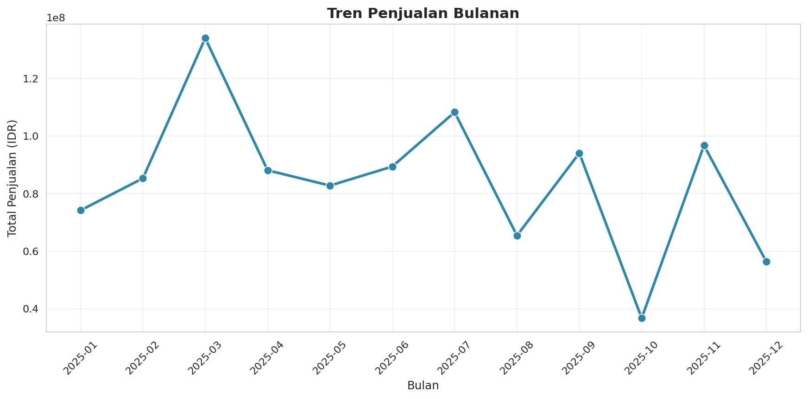
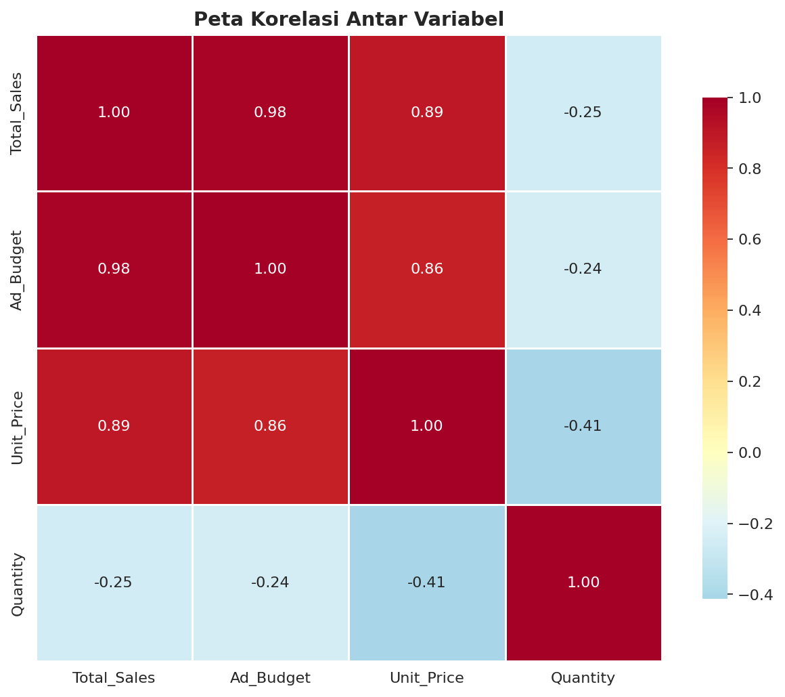
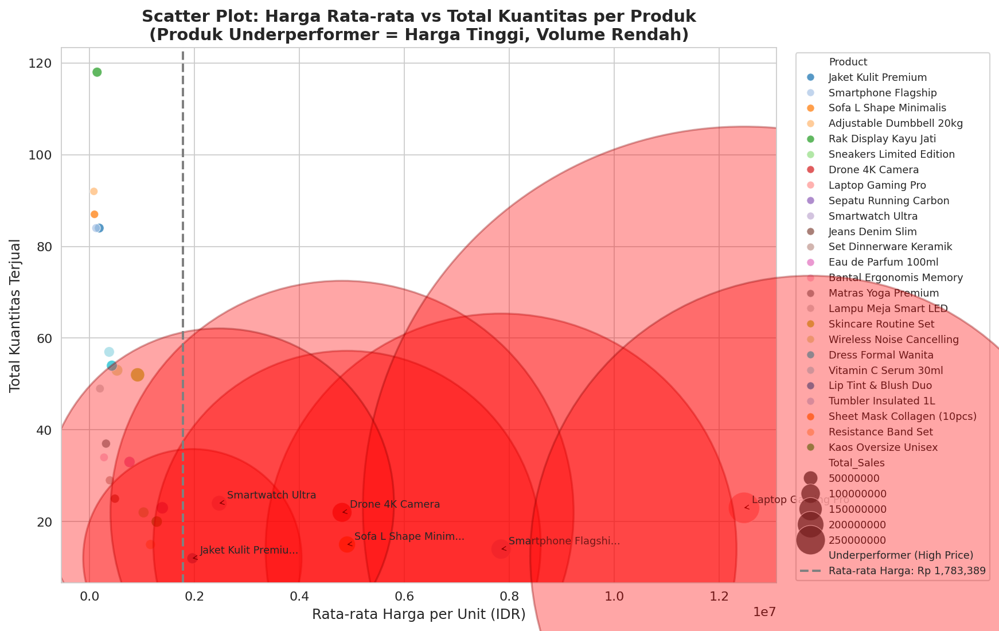
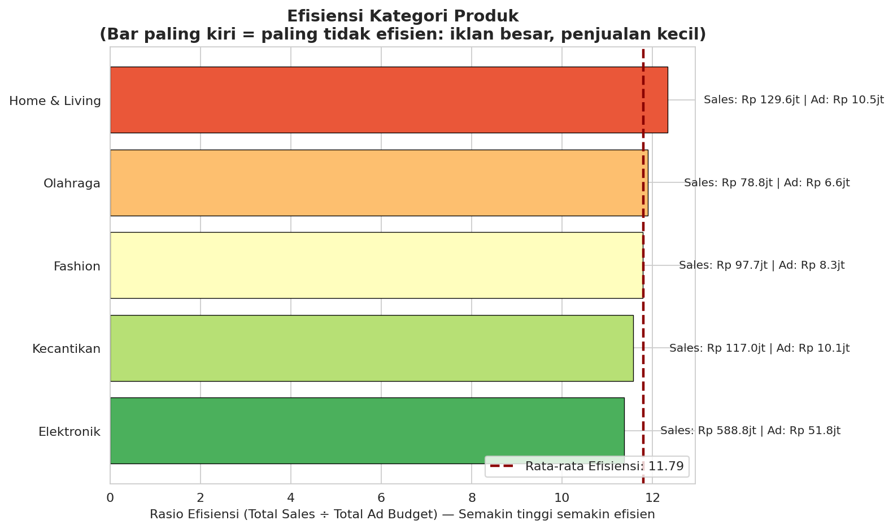

# 📊 Laporan Praktikum: Analisis Performa Penjualan E-commerce

**Nama:** [Tulis Nama Lengkap Kamu]  
**Mata Kuliah:** Analisis dan Visualisasi Data  
**Tanggal:** Juni 2026  
**Dataset:** ecommerce_sales_data.csv

---

## 1. Business Question

- Produk mana yang termasuk **underperformer** (harga tinggi tapi volume penjualan rendah)?
- Bagaimana segmentasi pelanggan menggunakan **RFM Analysis**?
- Kategori mana yang paling efisien dalam penggunaan anggaran iklan?
- Apakah peningkatan Ad_Budget berpengaruh signifikan terhadap Total_Sales?
- Seberapa besar pengaruh Ad_Budget terhadap penjualan?

---

## 2. Data Wrangling

- Dataset berisi 350 transaksi e-commerce.
- Dilakukan pembersihan data (menghapus data yang hilang pada kolom Ad_Budget).
- Total data setelah cleaning: 340 baris.

---

## 3. Insights

### 3.1 Tren Penjualan Bulanan

### 3.2 Korelasi Variabel

### 3.3 Produk Underperformer (Tugas 1)

**Temuan:** Produk seperti Laptop Gaming Pro, Drone, dan Sofa memiliki harga tinggi tetapi volume penjualan rendah.

### 3.4 RFM Analysis (Tugas 2)
- Jumlah pelanggan: 100
- Sekitar **30+ pelanggan** direkomendasikan mendapatkan voucher loyalitas.

### 3.5 Efisiensi Kategori (Tugas 3)

### 3.6 Uji Hipotesis (Tugas 4)
- Perbedaan Total_Sales antara kelompok Ad_Budget tinggi dan rendah **signifikan** (p-value < 0.05).

### 3.7 Regresi Linear
- Setiap kenaikan Rp1 Ad_Budget diprediksi menaikkan sales sebesar **Rp 10.56**
- R² = 0.953

---

## 4. Recommendation

1. Review harga dan promosi untuk produk underperformer.
2. Berikan voucher loyalitas kepada pelanggan RFM tinggi.
3. Realokasikan budget iklan ke kategori yang lebih efisien.
4. Tingkatkan budget iklan secara bertahap karena terbukti berpengaruh positif.

---

## File yang Disertakan

- `ecommerce_sales_data.csv` (Dataset)
- 5 file visualisasi (PNG)
- `praktikum_ecommerce_analysis.py` (Script Python)

---

**Catatan:** Laporan ini dibuat mengikuti struktur yang diminta dosen.
